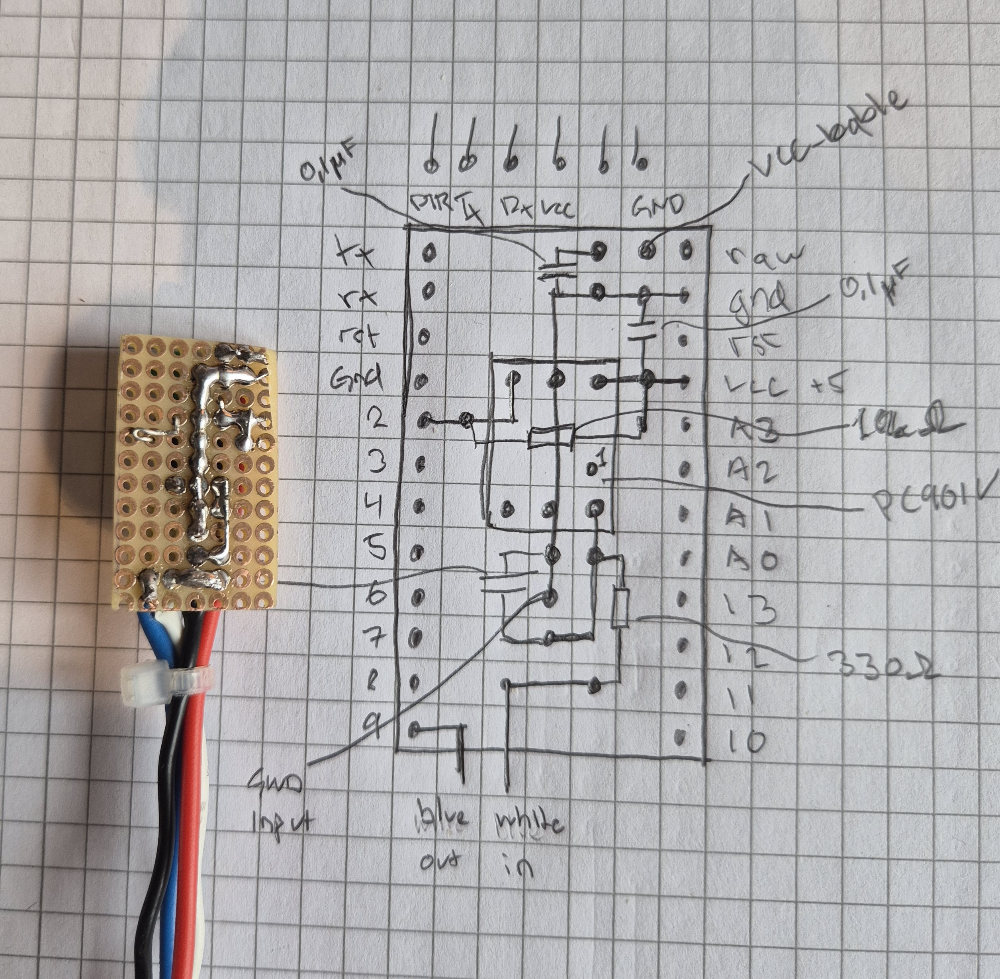
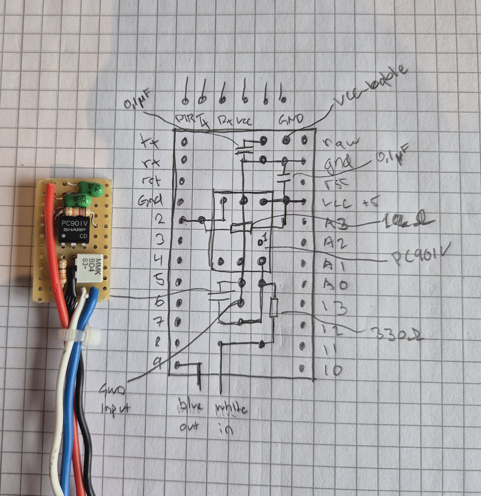

# MotorcycleSpeedCalibrator
MotorcycleSpeedCalibrator is an Arduino-based project for calibrating and modifying square wave signals from motorcycle speed sensors. It enables precise adjustments for speedometer accuracy after modifications like sprocket or tire changes, with features like adaptive filtering, EEPROM storage, and serial interface.

## Features
- **Signal Calibration**: Adjust the speed signal percentage to match your motorcycle's modifications.
- **Adaptive Filtering**: Optional dynamic smoothing for stable and responsive signal processing.
- **EEPROM Storage**: Retains calibration settings even after power loss.
- **Serial Interface**: Configure and debug the system via a simple serial menu.
- **Opto-Isolated Design**: Ensures electrical isolation for safety and reliability.

## How It Works
The system reads the square wave signal from the motorcycle's speed sensor, processes it using an Arduino, and outputs a modified square wave signal. The modification is based on a user-defined percentage, allowing for precise calibration.

### Enclosure


### Circuit Overview
- **Input Side**: Uses a PC901V opto-isolator to safely interface with the motorcycle's speed sensor.
- **Output Side**: Outputs a calibrated square wave signal back to the motorcycle's system.
- **Optional Noise Filtering**: Includes capacitors to reduce noise on both input and output sides.

#### PCB Topside


#### PCB Underside


### Example Calculation
For a motorcycle with an 18-inch rear wheel:
- Rear wheel circumference: `pi * 18 inches = 1.437 meters`
- Speed: `250 km/h = 69.444 m/s`
- Frequency: `69.444 m/s ÷ 1.437 m = 48.4 Hz`
- Adjusted frequency after sprocket ratio: `48.4 Hz ÷ 0.37 = 130.1 Hz`
- Final frequency (4 pulses per revolution): `130.1 Hz * 4 = 520.4 Hz`
- Period: `1 ÷ 520.4 Hz = 1920 µs`

## Serial Menu Commands
- **`s`**: Set the calibration percentage (0–200%).
- **`r`**: Read the current calibration percentage.
- **`h`**: Display the help menu.
- **`d`**: Toggle debug mode.

## Pin Configuration
- **Input Pin**: `D2` (connected to the speed sensor via opto-isolator).
- **Output Pin**: `D9` (outputs the calibrated square wave signal).
- **Built-in LED**: `D13` (used for status indication).

## Installation
1. Clone this repository:
   ```bash
   git clone https://github.com/your-username/MotorcycleSpeedCalibrator.git
2. Open the project in the Arduino IDE.
3. Install the required libraries:
   - [TimerOne](https://github.com/PaulStoffregen/TimerOne) 
   - [SimpleTimer](https://github.com/jfturcot/SimpleTimer) 
   - EEPROM (built into the Arduino IDE)
4. Connect your Arduino to your computer.
5. Upload the main.cpp code to your Arduino board.
6. Assemble the circuit as described in the comments of main.cpp.
7. Open the Serial Monitor in the Arduino IDE (set to 9600 baud) to configure and test the system.

## Dependencies
This project uses the following libraries:

1. **TimerOne**  
   A library for configuring and using Timer1 on Arduino boards.
2. **SimpleTimer**  
   A lightweight library for managing timed events.
3. **EEPROM**  
   Built into the Arduino IDE for reading and writing to the EEPROM.

## License
This project is licensed under the MIT License.